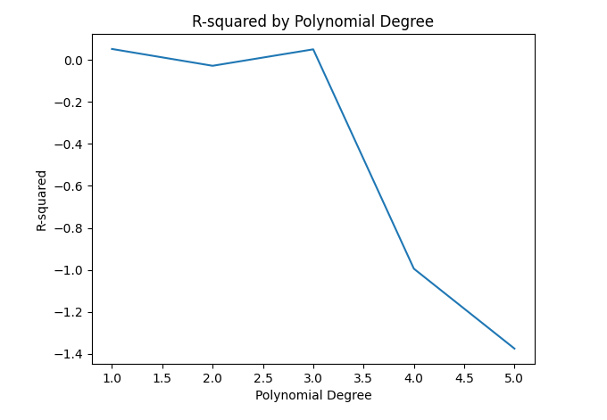

# Laptop Price Model Evaluation & Refinement

This project demonstrates how regression models can be evaluated and improved to predict laptop prices.

It simulates a real-world machine learning workflow, focusing on model evaluation, overfitting detection, and performance optimization.

---

## Techniques Used

- Train/test split  
- Linear regression  
- Cross-validation  
- Polynomial regression  
- Ridge regression (regularization)  
- Hyperparameter tuning with GridSearchCV  

---

## Model Complexity vs Performance

This plot shows how increasing polynomial complexity impacts model performance.  
Higher-degree models begin to overfit the data, leading to worse performance on unseen test data.

---

## Ridge Regularization Impact

.png)

This plot illustrates how the regularization parameter (alpha) affects model performance.  
Increasing alpha helps reduce overfitting and improves generalization on test data.

---

## Key Insight

The most complex model does not always perform best.  
Models that generalize well to unseen data provide more reliable predictions than those that only fit the training data.

---

## Key Outcome

Identified the optimal model complexity and regularization parameter (alpha) to improve generalization and reduce overfitting.

---

## Tools

Python, Pandas, Scikit-learn, Matplotlib
